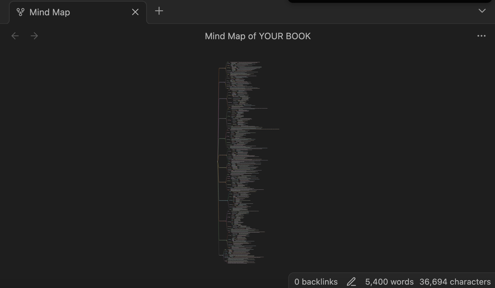

# MindmapAI - Create detailed mindmaps from books

I have a really bad memory when it comes to books. I often need to re-read lots of things I once read just to remember a little bit about that *theme* or *field* I once found fascitaning. I am tired of doing that. That's why I developed this application. By creating detailed mindmaps from these books, I do not need to re-read them, I just use the created mindmaps. 

The mindmaps that result from this application, are structured respecting the original structure of the book. Each chapter will have its own features, its own role in the book, so every chapter contribute to the final mindmap. Images will be interpreted as well during the text extraction from the pdf.

The output will be a markdown-type of text. If you insert this output text in an app like **Obsidian** with the mindmap extension enable you'll see the mindmap. 



 
## Table of Contents

- [How are these mindmaps created?](#how-are-these-mindmaps-created?)
- [Indexer](#1-indexer)
- [Summarizer, Quote Extraction and MindMapCreator](#2-summarizer-quote-extraction-and-mindmapcreator)
- [Pipeline](#3-pipeline-model)
- [Examples](#4-examples)

## How are these mindmaps created?

I will use an agentic workflow in order to create them (*with no frameworks... yep, you read that right, no frameworks. Everything created from scratch*) following these steps:

1. **Indexer**: **Extract the index from the book** if it exists. This is a crucial step by the way, since everything is created from this point. If the index does not exist, one will be created. Once it has been extracted, we can extract as well the **chapter-domain**, that is, the pages each chapter spans.

2. **Summarizer**: **Each chapter will be summarized**. 

3. **QuoteExtracter**: **Relevant quotes will be extracted from each chapter**

4. **MindMapCreator**: Once all steps have been completed, a mindmap will be put together based on the gathered information. 

```The python code```: 

```python
try:
        self._indexer = Indexer(indexer_config=indexer_config)
        self._summarizer = AgentSummarizer(config=summarizer_config)
        self._mind_map_creator = MindMapCreatorAgent(config=mind_map_config)
        self._quote_extractor = QuoteExtractorAgent(config=quote_extractor_config)
    except Exception as e:
        logger.error(f"Could not initialize some agent -> {e}")
        raise e

    try:
        indexer_info: IndexerInfo = await self._indexer.arun()
        logger.info(f"Indexer finished for book: {path}")
        summarizer_info, quote_extraction_info = await self._summarize_quote_extraction_in_paralel(indexer_info=indexer_info)
        logger.info(f"Summarizer and Quote Extraction finished for book: {path}")
        mind_map_info: MindMapCreatorInfo = await self._mind_map_creator.arun(summarizer_info)
        logger.info(f"MindMapCreator finished for book: {path}")
        mind_map_info.update_mind_map(quotes=quote_extraction_info)
    except Exception as e:
        logger.error(f"Error -> {e}")
        raise e
```

Let's deep dive in each of them. 

### 1. Indexer


This is where everything starts, and the most important part of the process. We want to extract the book's index in the most accurate way possible. There is a two step process: 

1. ```Docling``` will be used to perform OCR and extract the text and images.

2. ```LLMs``` will be used to actually extract the index if it exists. 


#### 1.1 Docling step

```python

async def _initialize(self) -> None:
    try:
        self._docling_output: ConversionResult = await asyncio.to_thread(self._extract_docling_output)
    except Exception as e:
        logger.error(f"Fatal error. Could not initialize Indexer -> {e}")
        raise e
    self._docling_output_dict: dict = self._docling_output.document.export_to_dict()
    self._docling_output_markdown: str = self._docling_output.document.export_to_markdown()
    self._number_of_pages = sorted(self._docling_output_dict['pages'].values(), key=lambda x: -x['page_no'])[0]['page_no']
    
    self.__intialized = True
    logger.info(f"Indexer initialized for book: '{self._path}' -> Number of pages: {self._number_of_pages}")

```

#### 1.2 Index Extraction using LLMs

The objective is this: **Map chapter $\implies$ page range** to get a complete view of the book structure. 

- **Principal method**: Use an llm to extract the index. Docling will parse quite well the index from the book in a very easy way for an llm to understand. Usually, a book's index is placed either at the begining or the end of the book itself. We'll give the first part and the last part of the book to an llm to extract the index. 

```python
async def _extract_chapters(self) -> List[str]:
        
    proportion = self._compute_index_proportion()

    try:
        index_exists = await self._llm_extract_index(
            text=self._docling_output_markdown[:proportion]
        )
        if self._NO_INDEX_FIELD in index_exists:
            index_exists = await self._llm_extract_index(
                text=self._docling_output_markdown[-proportion:]
            )
    except Exception as e:
        logger.error(f"Could call llm for book: {self._path} -> {e}")
        raise e
        
    return [c.strip() for c in index_exists.split("\n") if c]  
```

If this does not work we have several callbacks: 
- **Callback 1**: Use markdown to get the bold titles of the book that appear at the begining of pages. 
- **Callback 2**: Use an llm to extract titles by looking just at the begining of pages in case the are a lot of markdown titles detected. 

```python
async def _callback_for_index_extraction(self) -> List[str]:
    try:
        markdown_callback = self._markdown_index_extraction_callback()
        if len(markdown_callback):
            return markdown_callback
        logger.warning(f"Book: '{self._path}'. Markdown callback did not yield any chapters")
        llm_callback = await self._llm_index_extraction_callback()
        return llm_callback
    except Exception as e:
        logger.error(f"Book: '{self._path}' callback index extraction failed -> {e}")
        raise CallbackIndexExtractionException(f"Callback failed -> {e}")
```

#### 1.3 Chapter Domain

Once we have extracted the chapter titles with their start page, we need to actually create the domain. If an index states that the start page of a given chapter is 5, that does not mean that it actually starts in the page number 5 of the hole book. Maybe, this 5 is actually page number 10 in the book starting from the cover. We need to extract this **offset** to be able to accurately separete the chapters between each other. 

To compute this offset we'll follow this logic for each chapter:

1. Look for the extracted chapter title in the book to compute the offset.  
2. Return the most repeated offset. 

```python
offset_page_freq: Dict[int, int] = {}
for chapter in chapter_to_page:
    chapter_title = chapter.split(self._CHAPTER_PAGE_SEPARATOR)[0].strip()
    try:
        chapter_page = int(chapter.split(self._CHAPTER_PAGE_SEPARATOR)[1].strip())
    except IndexError:
        logger.warning(f"Book: '{self._path}' has a chapter with no separator -> {chapter}")
        chapter_page = 0
    except ValueError:
        logger.warning(f"Book: '{self._path}' has a chapter with no page detected -> {chapter}")
        chapter_page = 0

    for page_number, page_text in page_to_text.items():
        begin_text = " ".join(page_text.split(" ")[:self._MAX_WORDS_PER_CHAPTER_CALLBACK])

        if (chapter_title.lower() in begin_text.lower().replace("\n", " ") 
            and not f"{chapter_title.lower()} " + str(chapter_page) in begin_text.lower()):
            if page_number < max_page // 5 or page_number > (max_page - max_page // 5):
                continue
            offset_page = page_number - chapter_page
            if offset_page not in offset_page_freq:
                offset_page_freq[offset_page] = 0
            offset_page_freq[offset_page] += 1

offset_page = self._return_most_repeated_offset(offset_page_freq)
```

With this, we would have extracted each chapter with their real domain. 

**Note**: *There are a few more callbacks and retry logic in the code in case some chapter is not properly extracted, or some chapter is missing, but this is the main part of the code that needs to be understood.*


### 2. Summarizer, Quote Extraction and MindMapCreator

These three models inherit from the same *base* model, and their behaviour is practically the same except for the taks they perform. This task is determined by the prompts. 

Basically, they will take each chapter and summarize it, extract quoutes from it, and create a mindmap from that summary. That's it. Since we've been able to detect the main areas of the book (the different chapters), the rest is just extract the information that we find important. 


### 3. Pipeline model

This process is run using a pipeline model. 

#### 3.1 Pipeline Configuration

```python
class PipelineConfig(BaseModel):
    
    summary_model: str = "gpt-4o"
    mind_map_model: str = "gpt-4o"
    merge_mind_map_model: str = "gpt-4o"
    merge_summary_model: str = "gpt-4o"
    quote_extraction_model: str = "gpt-4o-mini"
    image_descriptor_model: str = "gpt-4o"

    tokens_to_summarize: int | None = None
    summary_tokens_per_minute: int | None = None
    mind_map_tokens_per_minute: int | None = None
    quote_extraction_tokens_per_minute: int | None = None
    tokens_to_extract_quotes: int | None = None
    max_number_of_tokens_index_proportion: int = 30_000
    index_tokens_batch: int = 10_000
    batch_images_descriptor: int = 10

    callback_index_pages_batch: int = 20
    min_pages_per_chapter_callback: int = 50
    max_words_per_chapter_callback: int = 10
```

Some parameters to avoid rate limit errors and to easily define the models to use in our llms. 

#### 3.2 Pipeline arun

```python
 async def arun(self, path: str) -> PipelineOutput:
    logger.info(f"Pipeline to be run for book: {path}")
    try:
        mind_map_info, price = await self._create_mind_map_of_book(path=path)
    except Exception as e:
        logger.error(f"Error in pipeline.arun -> {e}")
        raise e
    return PipelineOutput(mind_map=mind_map_info, price=price)

async def _create_mind_map_of_book(self, path: str) -> Tuple[MindMapCreatorInfo, float]:

    indexer_config: IndexerConfig = IndexerConfig(
        path=path,
        max_number_of_tokens_index_proportion=self.pipeline_config.max_number_of_tokens_index_proportion,
        index_batch=self.pipeline_config.index_tokens_batch,
        vision_model=self.pipeline_config.image_descriptor_model,
        batch_images=self.pipeline_config.batch_images_descriptor,
        callback_index_pages_batch=self.pipeline_config.callback_index_pages_batch,
        min_pages_per_chapter_callback=self.pipeline_config.min_pages_per_chapter_callback,
        max_words_per_chapter_callback=self.pipeline_config.max_words_per_chapter_callback
    )
    
    summarizer_config: SummarizerConfig = SummarizerConfig(
        model=self.pipeline_config.summary_model, 
        merge_model=self.pipeline_config.merge_summary_model, 
        max_tokens_to_summarize=self.pipeline_config.tokens_to_summarize, 
        max_tokens_per_minute=self.pipeline_config.summary_tokens_per_minute
    )
    
    mind_map_config: MindMapConfig = MindMapConfig(
        model=self.pipeline_config.mind_map_model, 
        max_number_of_tokens=self.pipeline_config.mind_map_tokens_per_minute
    )
    
    quote_extractor_config: QuoteExtractorConfig = QuoteExtractorConfig(
        model=self.pipeline_config.quote_extraction_model, 
        max_tokens_per_minute=self.pipeline_config.quote_extraction_tokens_per_minute, 
        max_tokens_to_extract_quotes=self.pipeline_config.tokens_to_extract_quotes
    )

    try:
        self._indexer = Indexer(indexer_config=indexer_config)
        self._summarizer = AgentSummarizer(config=summarizer_config)
        self._mind_map_creator = MindMapCreatorAgent(config=mind_map_config)
        self._quote_extractor = QuoteExtractorAgent(config=quote_extractor_config)
    except Exception as e:
        logger.error(f"Could not initialize some agent -> {e}")
        raise e

    try:
        indexer_info: IndexerInfo = await self._indexer.arun()
        logger.info(f"Indexer finished for book: {path}")
        summarizer_info, quote_extraction_info = await self._summarize_quote_extraction_in_paralel(indexer_info=indexer_info)
        logger.info(f"Summarizer and Quote Extraction finished for book: {path}")
        mind_map_info: MindMapCreatorInfo = await self._mind_map_creator.arun(summarizer_info)
        logger.info(f"MindMapCreator finished for book: {path}")
        mind_map_info.update_mind_map(quotes=quote_extraction_info)
    except Exception as e:
        logger.error(f"Error -> {e}")
        raise e
    
    self.__intermidiate_results = {
        'Indexer': indexer_info,
        'Summarizer': summarizer_info,
        'QuoteExtraction': quote_extraction_info,
    }

    price = indexer_info.price + summarizer_info.price + mind_map_info.price + quote_extraction_info.price
    logger.info(f"Pipeline for book: '{path}' finished. Final price: {price}")

    return mind_map_info, price
```

### 4. Examples

- Regular book: [main.ipynb] (https://github.com/jimysancho/MindmapAI/blob/main/main.ipynb)

- No Index book: [no_index_book.ipynb] (https://github.com/jimysancho/MindmapAI/blob/main/no_index_book.ipynb)